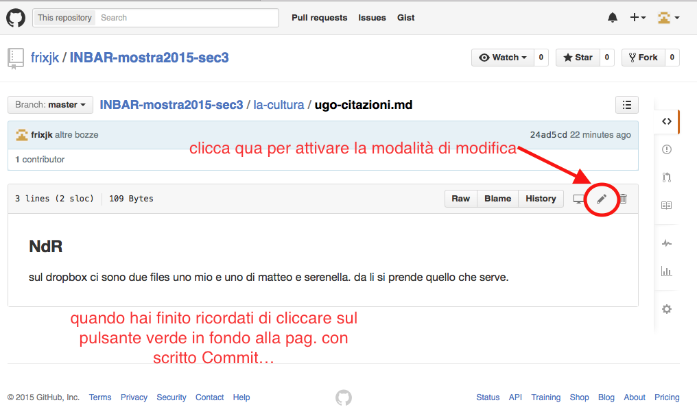

# INBAR-mostra2015-sec3

questo *repo* contiene i testi condivisi per la **sezione3**

## Attenzione!

In questo momento il repo è pubblico. Chiunque può leggere tutto. 

Per renderlo privato bisogna sottoscrivere un abbonamento. Il costo è  [abbordabile](https://github.com/pricing): 

- se lo fa un undividuo: 7 € per un mese con 5 repository e utenti illimitati
- come associazione 25 €/mese con 10 progetti privati.

### LAVORO su GitHub

 Le opzioni sono sostanzialmente due:
 
1. installi l'applicazione-desktop GitHub. Prima ti registri, poi la scarichi e la installi in locale. Una volta installata:
  - dalla pagina del progetto, sul web, selezioni *clona il progetto*
  - te lo scarica nella directory da cui lo gestisci **in locale**, modifichi aggiungi ecc. lavorando e salvando sul tuo pc (anche offline) e poi ti colleghi e sincronizzi con GitHub, per aggiornare.
   - la cosa interessante è che restano tutti i file antecedenti alle modifiche e si capisce chi le ha fatte e quali sono.
1. **NON** installi l'applicazione desktop:
   - scrivi e correggi qui sul web (seleziona la matita in alto a destra) e poi io aggiorno i file sul _mio_ archivio locale.  - 

------

-----

### markdown

conviene scrivere in [markdown](http://daringfireball.net/projects/markdown/) o [multimarkdown](http://fletcherpenney.net/multimarkdown/) per ottenre il file di solo-testo **ma** con le formattazioni. Ad es. questo testo è scritto in md. Se selezioni la matita per la modifica la finestra che si apre è già predisposta. Per le formattazioni semplici ci vogliono 3 minuti:

- per il testo *enfatizzato* metti prima e dopo la/e parola/e un asterisco * oppure un underscore _
- per il **grassetto** (che sarebbe meglio non usare: due asterischi prima e dopo
- grassetto enfatizzato (***orrore tipografico***) tre asterischi prima dopo
- per fare un elenco coi trattini vai a capo due volte e scrivi premettettendo il trattino seguito da uno spazio
- per un elenco numerato a capo due volte e scrivi 1. seguito da uno spazio. non serve numrare, scrivi sempre 1. e si numererà da solo. 

Il resto ad una prox puntata oppure guardati i link sotto che ti rinviano ai siti con le sintassi.

La sintassi di markdown è semplicissima e consente di scrivere file in plaintext che possono essere convertiti in testo formattato. I vanyaggi sono molteplici:

- files leggeri
- formato aperto, non proprietario,
- sei indipendente dalla piattaforma (mac. qin linux)
- li leggerai sempre anche in futuro (a differenza di doc, docx e simili che dipendono da un proprietario)
- altro che ti vai a leggere da solo se ti interessa l'argomento.

#### app md per PC (windows)

non uso questo sistema operativo sicché non ho provato le apps:

- [markpad](http://code52.org/DownmarkerWPF/)
- [MarkdownPad](http://fletcherpenney.net/multimarkdown/) la versione base e free ma in gni caso la pro costa pochissimo: $14.95, pocop più di 10 €.
- [writemonkey](http://writemonkey.com/index.php)
- [haropad](http://pad.haroopress.com) guarda il video
 
#### app md per Mac

- [multimarkdown composer](http://multimarkdown.com)
- TextMate
- [mou](http://25.io/mou/) 
- per Mac ce ne sono un mucchio, basta fare un ricerca sul web

#### editor on-line (multipiattaforma): 

 - [dillinger](http://dillinger.io) -- provalo!
 - [markable](https://markable.in)
 - [stackedit](https://stackedit.io/editor) ha l'interfaccia tipo wordprocessr e scrive automaticamente la sintassi corretta

